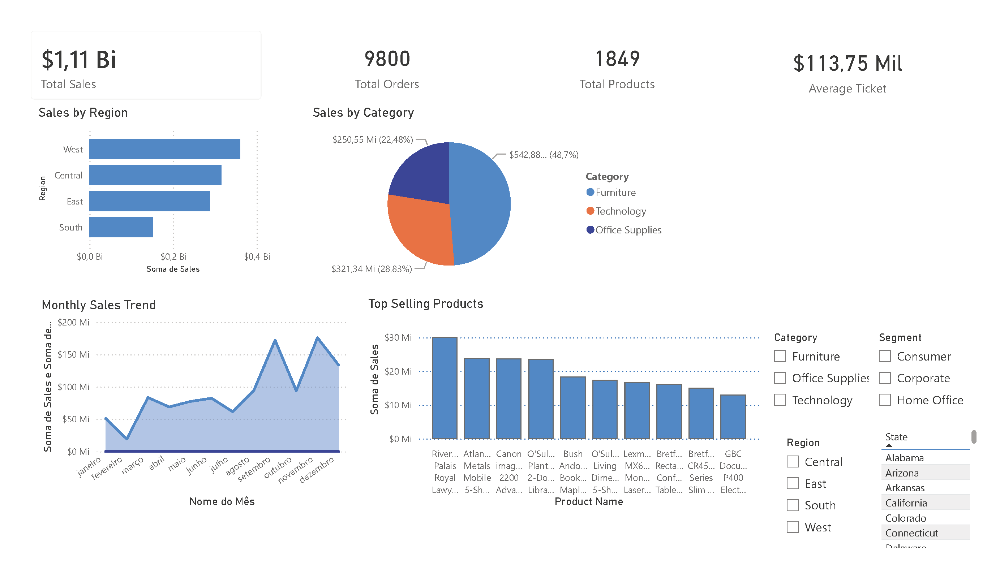

# 📊 Análise de Vendas - Power BI

Projeto de análise de dados utilizando Power BI com dataset de vendas.

## Objetivo
Analisar desempenho de vendas por:
- Região
- Categoria
- Produto
- Mês

## Ferramentas utilizadas
- Power BI
- Excel / CSV
- Kaggle
- GitHub

## Indicadores criados
- Total de Vendas
- Total de Pedidos
- Quantidade de Clientes
- Ticket médio

## Dashboard

![Dashboard] 
" 

## Dataset
Dataset público disponível no Kaggle.
